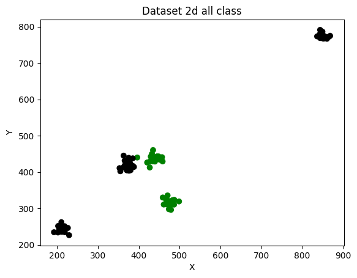

# Machine Learning Tools
Ferramentas que desenvolvi para utilizar no meu dia-a-dia com Machine Learning, principalmente no meu mestrado.

## articial_data/maker_dataset_command.py

Um gerador de dataset voltado para aprendizado PU (Positive Unlabeled). Funciona com uma classe principal, aonde os parâmetros de instanciação definem como será a distribuição dos pontos no espaço.

### Instalação

#### Dependências

- Python (>= 3.12.2)
- NumPy (>= 2.1.0)
- Scikit Learn (>= 1.5.1)
- MatplotLib (>= 3.9.2)
- Pandas (>= 2.2.2)

### Uso

A classe principal **DatasetGenerator** precisa ser instânciada de acordo com o desejado. Basicamente é possível criar conjuntos de dados com grupos de pontos e escolher quantos grupos positivos ou não rotulados, em qualquer dimensão > 2. É possível determinar a similaridade intra grupos, a dissimiliradade entre grupos. Também é possível adicionar adicionar pontos de ruído no dataset, sendo possível parametrizar a quantidade. 

**Retornos**

O método **get_arrays()** retorna uma tupla com um array de array de features (*X*), um array de classe (*y*) e um array de classe para treinamento (*y_train*)

O método **get_dataframe()** retorna um dataframe Pandas com todas as informações anteriores.

Salva um *.csv* no path definido pelo parâmetro **output_path**.

O método **plot()** plota os dados utilizando a biblioteca MatplotLib. O argumento **y** pode ser 'all' ou 'train' e define qual a classe que será utilizada na plotagem. O booleano **fix_scale** fixa os limites passados no gráfico da plotagem.

**Parâmetros existentes:**

- **n_points**, Inteiro maior que 0 que define a quantidade de objetos do dataset. *Default*: 100.   
- **n_groups**, Inteiro maior que 2 que define a quantidade de grupos do dataset. *Default*: 2.
- **prop_groups**, Uma lista de *float* para determinar a proporção de pontos em cada grupo. Caso seja passado apenas 1 valor, ele valerá para todos os grupos. A soma dos valores precisar ser igual a 1. *Default*: 0.5 (por grupo).
- **binary_groups**, Uma lista de inteiros que podem ser 0 ou 1, que determina os rótulos dos grupos. O tamanho da lista precisa ser igual ao valor de *n_groups*. *Default*: 0, 1.
- **gamma**, Um *float* que determina uma porcentagem de dados positivos que mantém rótulo na saída de treinamento. *Default*: 0.05.
- **include_outliers**, Um booleano que determina se serão gerados outliers no dataset. *Default*: Falso.
- **prop_outliers**, Um *float* que determina a proporção de outliers em relação ao número total de pontos. *Default*: 0.05.
- **dimensions**, Um inteiro que determina a dimensã0 do conjunto de dados. *Default*: 2.
- **limits**, valores máximos e mínimos para os valores dos dados. *Default*: 0,0 - 500, 500.
- **similitarity**, Uma lista de *float* que determina a densidade dos grupos. Caso seja passado apenas 1 valor, ele valerá para todos os grupos. Deve ter tamanho igual ao número de grupos. *Default*: 0.5, 0.2.
- **dissimilarity**, Uma lista de *float* que determina a distância entre os grupos. Caso seja passado apenas 1 valor, ele valerá para todos os grupos. Deve ter tamanho igual ao número de grupos menos 1. *Default*: 0.7.
- **distance_metric**, Uma string que pode ser: euclidean, manhattan, chebyshev. Determina como é calculada a distância entre os centros dos grupos. *Default*: euclidean.
- **output_path**, String com o path e nome do arquivo *.csv* para salvar o dataset gerado. *Default*: ./dataset/csv

## Exemplos

Código disponível no notebook: 

>artiticial_data/notebook_exemplos.ipynb

#### Parâmetros default

  

#### Alterando a similaridade

   

#### Alterando a dissimilaridade

 

#### Aumentando o número de pontos

  

#### Aumentando o número de grupos

  

#### Para 3 dimensões

 

